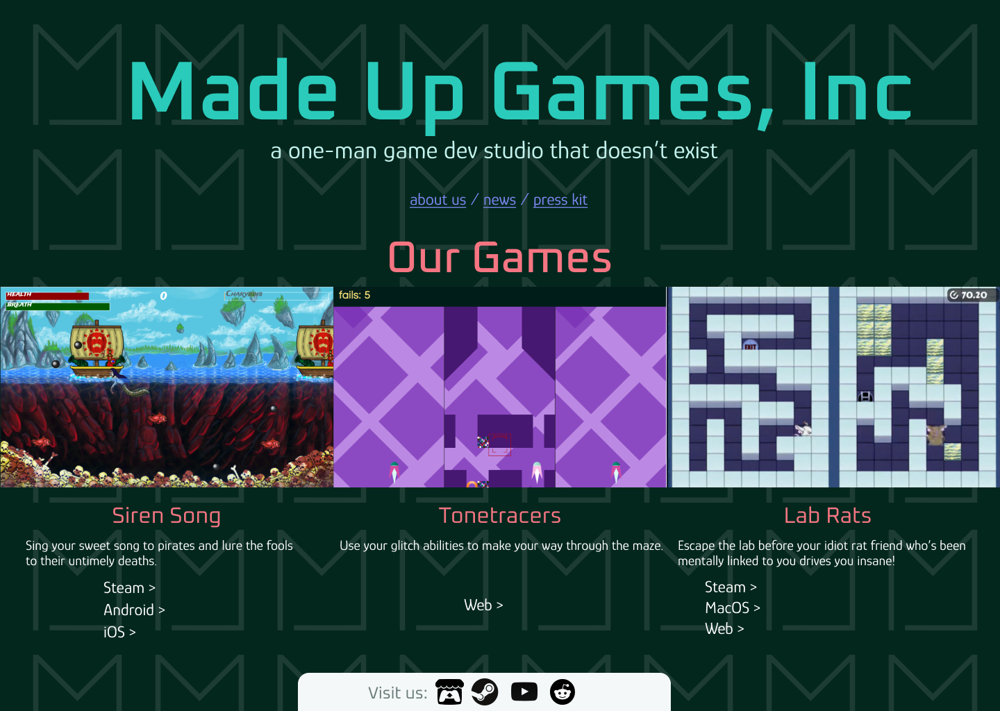
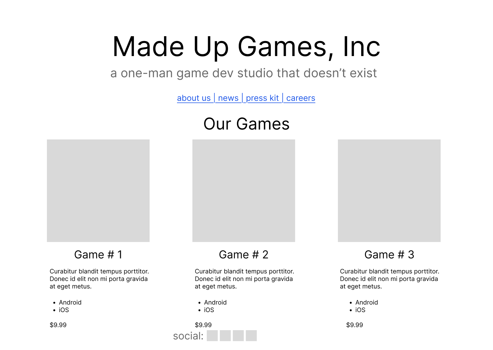
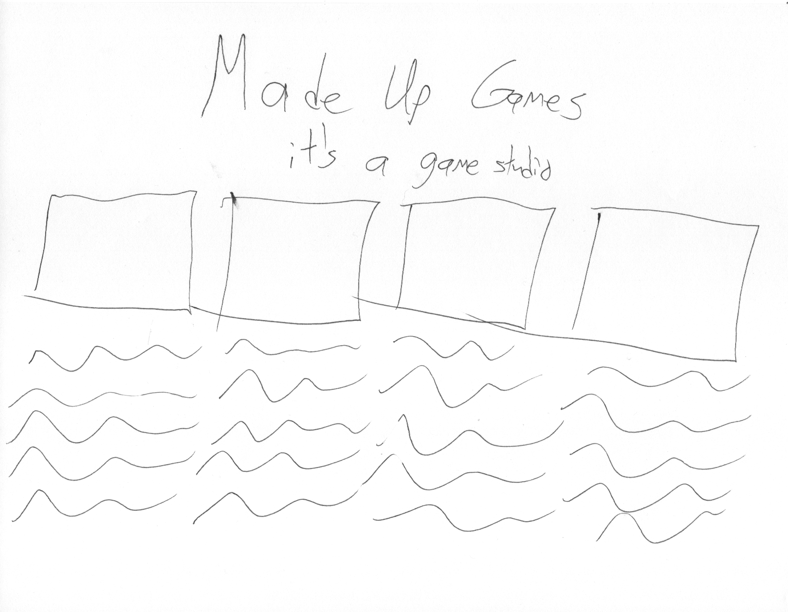

One of the benefits we are starting to see thanks to LLMs is rapid prototyping. It's much easier to cheaply and quickly produce not just production code, but also a prototype so you can test something out. In particular, user testing has always thrived off prototyping. Putting something in front of your users, getting their feedback, making a quick update, and repeated is a great way to get things right earlier and earlier in the process when it's easier to fix.

There's something I noticed, though. Under normal circumstances, LLMs usually want to jump immediately to something that looks complete, with high visual fidelity and all the details you could want. And it seems like getting high fidelity cheaply and quickly is great, yeah?

I think that sometimes, it's better to have something low fidelity.

Let me show you some examples. Take a look and just see where your mind goes - what questions you have, what it makes you think of, how you feel, etc.

First, this one:

Then this one:

And finally this one:

I bet you had different reactions to each one, yeah? The fidelity makes a difference.

The paper sketch is very rough. Very few decisions have been made about what this website even is - just a name, some pictures, and presumably some text.

The wireframe is getting a little more solid. Some decisions have been committed to around the layout and content strategy, but the final content is not ready.

The high-fidelity design is final, and it _looks_ final. The final content and the social media have been chosen, and the visual treatment is fully in place.

Even though they're just as easy to generate as lower fidelity prototypes now, higher fidelity prototypes carry different expectations about how far along you are in the process, and the types of decisions you can and cannot make. The higher the fidelity, the more it looks like a completed, unchangeable product.

So what do you do with this? Use the right fidelity level for the process.

Super low fidelity sketches are the best **super-early in the process**. A lot of ideas will not survive as you move farther along. The biggest caveat is that they can be so rough that they don't communicate everything you're trying to communicate to everyone, so it's best to leave your roughest sketches to your closest team. On the other hand, giving a pen and paper to stakeholders and having them draw what they think they want? Invaluable.

Wireframes are the best as you **go into requirements**. This is about the first place where inside stakeholders can look at something and figure out what you mean. It's recognizably a website! But yet, it's far enough away from a finalized layout to communicate that large changes can still be made.

High-fidelity designs are the best as you **do user testing** and **get final signoff from stakeholders and developers**. At this point, it looks like a final product. And that's what you can use to your advantage. Your users can try to use it as they would a completed product, and you'll get the most accurate feedback. Your developers know exactly what they're being asked to do and they can dial in their estimates.

This is admittedly very hard to get right; even in my years as a UX designer, I'm not sure I ever really nailed it. But it's worth doing.
